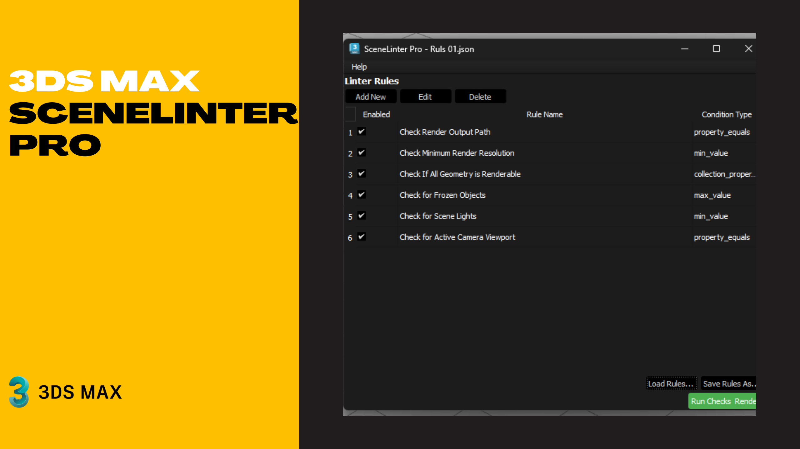

# SceneLinter Pro (Open Beta) 🚀
for Autodesk 3ds Max 2025+

A powerful and customizable scene validation tool for **Autodesk 3ds Max**.  
With this script, you can define a set of rules to validate your scene before rendering, helping you catch common mistakes and avoid faulty renders.

---

---

## 📖 About the Project
**SceneLinter Pro** was built to solve one of the biggest problems for 3D artists:  
**human errors that lead to wrong or incomplete renders**.  

With this tool, you can:  
- Create a **smart checklist** of rules.  
- Automatically verify settings such as render parameters, object properties, output paths, and more.  
- Even auto-fix certain issues with predefined scripts.  

---

## 🚀 Features
- ✅ **Custom Rules**: Define rules with conditions such as `min_value`, `max_value`, `property_equals`, etc.  
- ✅ **Scene Property Validation**: Check anything accessible in MaxScript—from render settings to object attributes.  
- ✅ **Smart Property Search**: Easily find properties by selecting an object or typing a keyword.  
- ✅ **Auto-Fix Support**: Attach MaxScript fixes to rules and solve issues with one click.  
- ✅ **Save & Load Rule Lists**: Store checklists as `.json` files and share them with your team.  

---

## ⚙️ Installation
1️⃣ **Download the Script**  
Grab the latest `SceneLinterPro.py` from the [Releases](./releases) section.  

2️⃣ **Install Dependencies**  
This script requires **PySide6**. Run the following in **Command Prompt** (as Administrator):  

3️⃣ Run in 3ds Max

SceneLinterPro.py run it via Scripting > Run Script...
1.  Download the `SceneLinter Pro.py` file.
2.  In 3ds Max, go to the **Scripting > Run Script** menu and execute the file.
3.  Run `SceneLinter Pro.py`

🛠️ How to Use
1. Create a New Rule

Click Add New to open the Rule Editor and define:

Condition Type → The type of check to perform.

MaxScript Target/Prop → A command that extracts a value from the scene.

Expected Value → The value you want to validate against.

Error Message → Message shown if the rule fails.

Auto-Fix Script → A MaxScript command to fix the issue automatically.

2. Run Checks

Click the green Run Checks & Render button:

✅ If all rules pass → you’ll see a success message.

❌ If some fail → a list of issues will appear.

3. Auto-Fix Issues

If auto-fix scripts are defined, the Attempt to Fix All button becomes available.
Click it to execute the fixes and resolve problems automatically.
